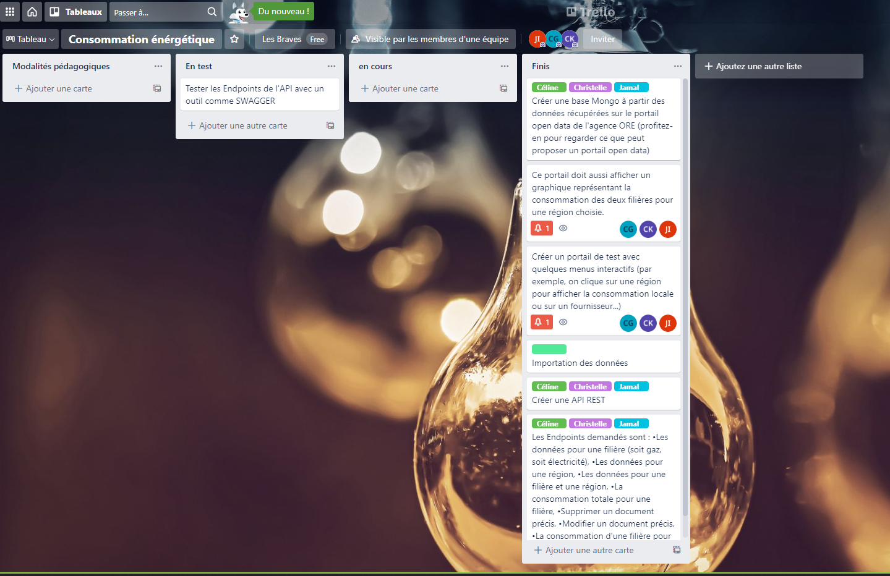

# Réalisation d'une API OpenData de la consommation d'énérgie:

Les données sur la consommation d'énergie en France à travers l'utilisation d'une une API REST.

## Test de l'API avec Postman:  

  

  

  

## Organisation du projet:  

  

